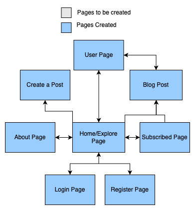

# CST-339 Java III Milestone Project

## Overview

The goal of this project will be to create a blog application that allows users to post a blog and view other postings. The users will have the ability to login and subscribe to other users. Each user will have their own profile page where their blogs are made available. The blogs will also appear on both a giant feed page where all posts are displayed and on a subscribed page where blog posts of subscribed users will appear. Each blog post will have a title, date, and content. When an unlogged in user navigates to any page on the site, they will be directed to the about page where they are prompted to either create an account or login.

## How to Run

1. Run the below command

```
git clone https://github.com/cst339/blogsite
```

2. Open the folder in VSCode
3. Open the `BlogsiteApplication.java` file and select the play icon in the top right of VSCode
4. Type localhost:8080 into the URL address bar of any web browser on the device

## How to setup the database

Run the .dll file in this root directory in MySql Workbench or use MAMP and run it as a SQL query.
Be sure the ports match in the `application.properties` file.

## How to Contribute

It's best to fork the repository and make commmits there to eventually be merged to this repository

## Site Map



## ER Diagram


## Initial Site Visit Experience (About Page):

When the user is not logged in, they will be redirected to the about page where they are prompted to log in or sign up. The about page will also contain other information that will inform them about the site and its purpose.

## Login and Sign up Experience:

The user can press the login or sign up buttons from the about page. The user will be need to enter their email address and password to login from the login page. The sign up page will contain 5 fields: username, email address, email confirmation, password, and password confirmation. After the user logs in or signs up, they will be directed to the home page which contains all the available blog posts on the site.

## Blog Post Browsing:

On the home page, users can browse all the posts available on the site from all users. A Subscribed page will also be listed which will allow to filter the blogs by subscribed to users only. The blog posts will be listed by their title along with a date and time they are posted. The title of the blog can be clicked to view the blog contents. The author’s username will also be displayed on the blog listing and content page and can be clicked to navigate to the user’s page. The user viewing their own user page will be given an option to delete their own blog post. An option to add a blog post will also appear on the user page if they are viewing their own page. An option to add a blog post will also appear on the homepage.

## Blog Post Creation:

The primary way to create a post is via a button on the home page. Clicking this button will bring you to a webpage that will allow you to author a post. A title that has a 100-character limit is required along with the main blog content that has a requirement of at least 100 words. After these requirements are met the user can click a button to post the blog where it will appear as an item on the home page or on a user’s subscribed page if they have subscribed to the author of the post.
